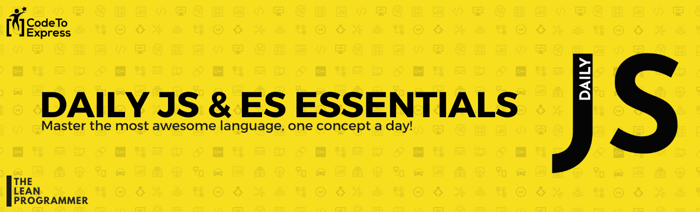

<h1 align="center">
  DailyJS
</h1>

  Coding is Fun! Do it everyday 💯💯
   
  Master the most awesome language, one concept a day!
   
  Learn one concept daily, code daily, add your own questions and solutions to the existing problems to this repo and submit a PR

***

      

## Table of Contents

| Day Number   | Topic                | Website Link  | Category |
| ----- |----------------------| -----| ------- |
| [Day 1](./day1)     | [The `forEach` Helper](./day1) | [http://madhavbahl.tech/dailyjs/day1/](http://madhavbahl.tech/dailyjs/day1/) | **ES Essentials - ES6 Helper** |
| [Day 2](./day2)     | [The `map` Helper](./day2)     | [http://madhavbahl.tech/dailyjs/day2/](http://madhavbahl.tech/dailyjs/day2/) | **ES Essentials - ES6 Helper** |
| [Day 3](./day3)     | [The `find` Helper](./day3)    | [http://madhavbahl.tech/dailyjs/day3/](http://madhavbahl.tech/dailyjs/day3/) | **ES Essentials - ES6 Helper** |
| [Day 4](./day4)     | [The `filter` Helper](./day4)    | [http://madhavbahl.tech/dailyjs/day4/](http://madhavbahl.tech/dailyjs/day4/) | **ES Essentials - ES6 Helper** |
| [Day 5](./day5)     | [The `every` Helper](./day5)    | [http://madhavbahl.tech/dailyjs/day5/](http://madhavbahl.tech/dailyjs/day5/) | **ES Essentials - ES6 Helper** |
| [Day 6](./day6)     | [The `some` Helper](./day6)    | [http://madhavbahl.tech/dailyjs/day6/](http://madhavbahl.tech/dailyjs/day6/) | **ES Essentials - ES6 Helper** |
| [Day 7](./day7)     | [The `reduce` Helper](./day7)    | [http://madhavbahl.tech/dailyjs/day7/](http://madhavbahl.tech/dailyjs/day7/) | **ES Essentials - ES6 Helper** |
| [Day 8](./day8)     | [Arrow Functions](./day8)    | [http://madhavbahl.tech/dailyjs/day8/](http://madhavbahl.tech/dailyjs/day8/) | **ES Essentials - ES6** |
| [Day 9](./day9)     | [Const and Let](./day9)    | [http://madhavbahl.tech/dailyjs/day9/](http://madhavbahl.tech/dailyjs/day9/) | **ES Essentials - ES6** |
| [Day 10](./day10)     | [Template Literals](./day10)    | [http://madhavbahl.tech/dailyjs/day10/](http://madhavbahl.tech/dailyjs/day10/) | **ES Essentials - ES6** |
| [Day 11](./day11)     | [Enhanced Object Literals](./day11)    | [http://madhavbahl.tech/dailyjs/day11/](http://madhavbahl.tech/dailyjs/day11/) | **ES Essentials - ES6** |
| [Day 12](./day12)     | [The Rest Parameter](./day12)    | [http://madhavbahl.tech/dailyjs/day12/](http://madhavbahl.tech/dailyjs/day12/) | **ES Essentials - ES6** |
| [Day 13](./day13)     | [The Spread Operator](./day13)    | [http://madhavbahl.tech/dailyjs/day13/](http://madhavbahl.tech/dailyjs/day13/) | **ES Essentials - ES6** |
| [Day 14](./day14)     | [Extracting Object Properties](./day14)    | [http://madhavbahl.tech/dailyjs/day14/](http://madhavbahl.tech/dailyjs/day14/) | **ES Essentials - ES6** |
| [Day 15](./day15)     | [Destructuring Function Args](./day15)    | [http://madhavbahl.tech/dailyjs/day15/](http://madhavbahl.tech/dailyjs/day15/) | **ES Essentials - ES6** |
| [Day 16](./day16)     | [Destructuring Arrays)](./day16)    | [http://madhavbahl.tech/dailyjs/day16/](http://madhavbahl.tech/dailyjs/day16/) | **ES Essentials - ES6** |
| [Day 17](./day17)     | [Destructuring Part 4](./day17)    | [http://madhavbahl.tech/dailyjs/day17/](http://madhavbahl.tech/dailyjs/day17/) | **ES Essentials - ES6** |
| [Day 18](./day18)     | [Destructuring Part 5](./day18)    | [http://madhavbahl.tech/dailyjs/day18/](http://madhavbahl.tech/dailyjs/day18/) | **ES Essentials - ES6** |
| [Day 19](./day19)     | [Destructuring Part 6](./day19)    | [http://madhavbahl.tech/dailyjs/day19/](http://madhavbahl.tech/dailyjs/day19/) | **ES Essentials - ES6** |
| [Day 20](./day20)     | [Destructuring Part 7](./day20)    | [http://madhavbahl.tech/dailyjs/day20/](http://madhavbahl.tech/dailyjs/day20/) | **ES Essentials - ES6** | 
| [Day 21](./day21)     | [Default Function Arguments](./day21)    | [http://madhavbahl.tech/dailyjs/day21/](http://madhavbahl.tech/dailyjs/day21/) | **ES Essentials - ES6** |
| [Day 22](./day22)     | [Class](./day22)    | [http://madhavbahl.tech/dailyjs/day22/](http://madhavbahl.tech/dailyjs/day22/) | **ES Essentials - ES6** |
| [Day 23](./day23)     | [Inheritance](./day23)    | [http://madhavbahl.tech/dailyjs/day23/](http://madhavbahl.tech/dailyjs/day23/) | **ES Essentials - ES6** |

## ES6 Helpers

Till the `Day 7` we have discussed about ES6 Helpers, which are as follows:

1. forEach
2. map
3. find
4. filter
5. every
6. some
7. reduce

You can download a free ebook for further reference - 

<a href="./es6helpers/ebook.pdf" style="display: inline-block; margin: 0.3em; padding: 1.2em 5em; overflow: hidden; position: relative; text-decoration: none; text-transform: uppercase; border-radius: 3px;  -webkit-transition: 0.3s; -moz-transition: 0.3s; -ms-transition: 0.3s; -o-transition: 0.3s;  transition: 0.3s; box-shadow: 0 2px 10px rgba(0,0,0,0.5); border: none;  font-size: 15px; text-align: center;   background-color: #03A9F4; color: white; margin-left: 38%;" download class="btn-rounded-white">Claim Your Free PDF Here</a>

## Disclaimer

I do not own the rights to the concepts I will discuss in this DailyJS initiative. The questions and concepts have been collected from various sources and I have tried to present them in a way that would be simple to understand. If you think you are the owner of any question or any code, send me an email at codetoexpress@gmail.com, I will be more than happy to give the appropriate credits.