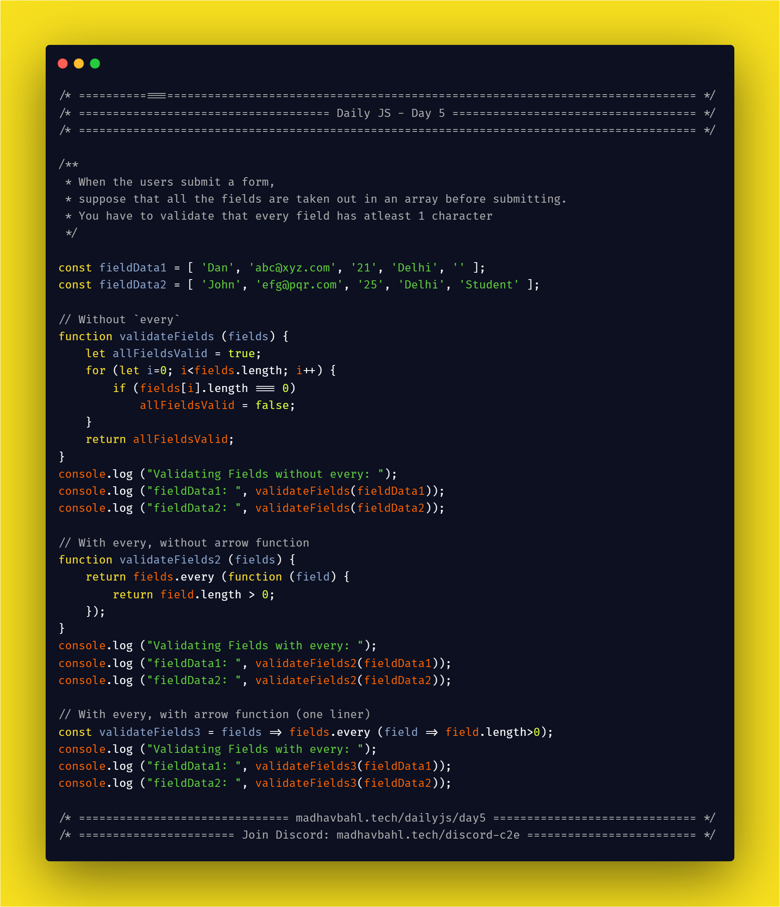

# Day 5: The `every` helper


The `every` helper is used to find whether all the elements in a given list pass a specific condition.

The condition is passed in the iterator function, and it executes that function once for each element in the list.

If, for any element, the iterator function returns false, `every()` returns false. Otherwise, it returns true.

## Syntax

```js
array.every(function(currentValue, index, arr), thisValue)
```

- **currentValue**: Required.
    The value of the current element
- **index**: Optional
    The array index of the current element
- **arr**: Optional.
    The array object the current element belongs to
- **thisValue**: Optional.
    A value to be passed to the function to be used as its "this" value.

## [Simple Example](./1.js)

**When the users submit a form, suppose that all the fields are taken out in an array before submitting the form. You have to validate that every field has atleast 1 character**

```js
const fieldData1 = [ 'Dan', 'abc@xyz.com', '21', 'Delhi', '' ];
const fieldData2 = [ 'John', 'efg@pqr.com', '25', 'Delhi', 'Student' ];

// Without `every`
function validateFields (fields) {
    let allFieldsValid = true;
    for (let i=0; i<fields.length; i++) {
        if (fields[i].length === 0)
            allFieldsValid = false;
    }
    return allFieldsValid;
}
console.log ("Validating Fields without every: ");
console.log ("fieldData1: ", validateFields(fieldData1));
console.log ("fieldData2: ", validateFields(fieldData2));

// With every, without arrow function
function validateFields2 (fields) {
    return fields.every (function (field) {
        return field.length > 0;
    });
}
console.log ("Validating Fields with every: ");
console.log ("fieldData1: ", validateFields2(fieldData1));
console.log ("fieldData2: ", validateFields2(fieldData2));

// With every, with arrow function (one liner)
const validateFields3 = fields => fields.every (field => field.length>0);
console.log ("Validating Fields with every: ");
console.log ("fieldData1: ", validateFields3(fieldData1));
console.log ("fieldData2: ", validateFields3(fieldData2));
```

## [Another Simple example](./2.js)

**Slots of people are sent for driving license test, check whether each person in a slot is 18 years or above**

```js
const slot1 = [
    { name: 'John', age: 16 },
    { name: 'Matt', age: 20 },
    { name: 'Dan', age: 17 },
];
const slot2 =  [
    { name: 'Amanda', age: 32 },
    { name: 'Kepler', age: 20 },
    { name: 'Stan', age: 25 },
];

// Without arrow functions
function validateSlot (slot) {
    return slot.every (function (person) {
        return person.age >= 18;
    });
}
console.log ("Result 1 \n------------------");
console.log ("Slot 1: ", validateSlot (slot1));
console.log ("Slot 2: ", validateSlot (slot2));
console.log ("------------------");

// With arrow functions
const validateSlot2 = slot => slot.every (person => person.age>=18);
console.log ("Result 2 \n------------------");
console.log ("Slot 1: ", validateSlot2 (slot1));
console.log ("Slot 2: ", validateSlot2 (slot2));
```

## Homework for you

Check whether a set of numbers is
   1. Even
   2. Odd
   3. Prime
   4. Negative
   5. Positive
   6. Perfect Square
   
> Feel free to add more  :)

## Download your free eBook

<a href="./ebook.pdf" style="display: inline-block; margin: 0.3em; padding: 1.2em 5em; overflow: hidden; position: relative; text-decoration: none; text-transform: uppercase; border-radius: 3px;  -webkit-transition: 0.3s; -moz-transition: 0.3s; -ms-transition: 0.3s; -o-transition: 0.3s;  transition: 0.3s; box-shadow: 0 2px 10px rgba(0,0,0,0.5); border: none;  font-size: 15px; text-align: center;   background-color: #03A9F4; color: white; margin-left: 38%;" download class="btn-rounded-white">Claim Your Free PDF Here</a>

## Carbon code sample

