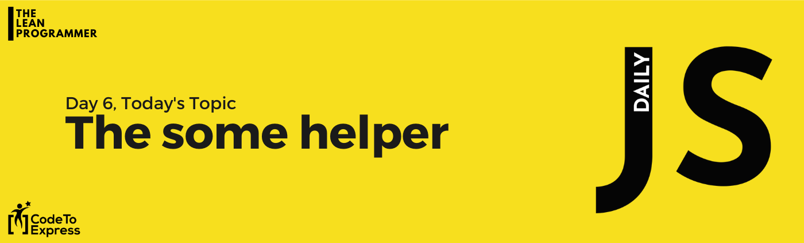
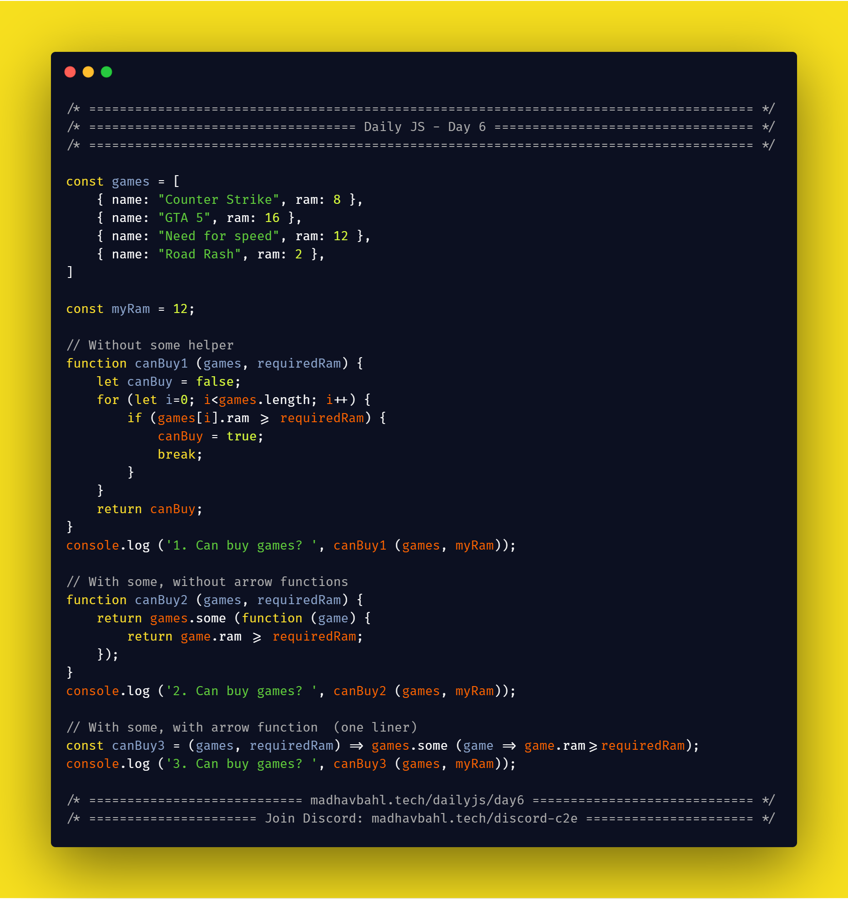

# Day 6: The `some` helper



The `some` helper is used to find if any one or more elements in the given list, pass a specific condition.

The condition is passed in the iterator function, and it executes that function once for each element in the list.

If, for any element, the iterator function returns true, `some()` returns true. Otherwise, it returns false.

Usage and syntax is similar to `every` helper

## Syntax

```js
array.some(function(currentValue, index, arr), thisValue)
```

- **currentValue**: Required.
    The value of the current element
- **index**: Optional
    The array index of the current element
- **arr**: Optional.
    The array object the current element belongs to
- **thisValue**: Optional.
    A value to be passed to the function to be used as its "this" value.

## [Simple Example](./1.js)

**Given a collection of games with mentioned least required RAM, buy the collection, if atleast one of the games can run in your computer (return true/false)**

```js
const games = [
    { name: "Counter Strike", ram: 8 },
    { name: "GTA 5", ram: 16 },
    { name: "Need for speed", ram: 12 },
    { name: "Road Rash", ram: 2 },
]

const myRam = 12;

// Without some helper
function canBuy1 (games, requiredRam) {
    let canBuy = false;
    for (let i=0; i<games.length; i++) {
        if (games[i].ram >= requiredRam) {
            canBuy = true;
            break;
        }
    }
    return canBuy;
}
console.log ('1. Can buy games? ', canBuy1 (games, myRam));

// With some, without arrow functions
function canBuy2 (games, requiredRam) {
    return games.some (function (game) {
        return game.ram >= requiredRam;
    });
}
console.log ('2. Can buy games? ', canBuy2 (games, myRam));

// With some, with arrow function  (one liner)
const canBuy3 = (games, requiredRam) => games.some (game => game.ram>=requiredRam);
console.log ('3. Can buy games? ', canBuy3 (games, myRam));
```

## [Another Example](./2.js)

Do the same question we did in `every` helper, but by usinig `some` helper

**Slots of people are sent for driving license test, check whether each person in a slot is 18 years or above**

**Hint:** (Every person > 18) is equivalent to (no person <18).

Try to apply this hint to do this problem using `some` helper instead of `every` helper

```js
/**
 * Slots of people are sent for driving license test, 
 * check whether each person in a slot is 18 years or above.
 */

const slot1 = [
    { name: 'John', age: 16 },
    { name: 'Matt', age: 20 },
    { name: 'Dan', age: 17 },
];
const slot2 =  [
    { name: 'Amanda', age: 32 },
    { name: 'Kepler', age: 20 },
    { name: 'Stan', age: 25 },
];

const validateSlot = slot => !(slot.some (person => person.age<18));

console.log ("Slot 1: ", validateSlot (slot1));
console.log ("Slot 2: ", validateSlot (slot2));
```

## Homework for you

Check whether a set of numbers has any element which is
   1. Even
   2. Odd
   3. Prime
   4. Negative
   5. Positive
   6. Perfect Square

> Feel free to add more :)

## Download your free eBook

<a href="./ebook.pdf" style="display: inline-block; margin: 0.3em; padding: 1.2em 5em; overflow: hidden; position: relative; text-decoration: none; text-transform: uppercase; border-radius: 3px;  -webkit-transition: 0.3s; -moz-transition: 0.3s; -ms-transition: 0.3s; -o-transition: 0.3s;  transition: 0.3s; box-shadow: 0 2px 10px rgba(0,0,0,0.5); border: none;  font-size: 15px; text-align: center;   background-color: #03A9F4; color: white; margin-left: 38%;" download class="btn-rounded-white">Claim Your Free PDF Here</a>

## Carbon code sample

