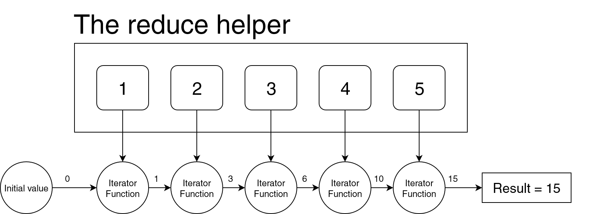
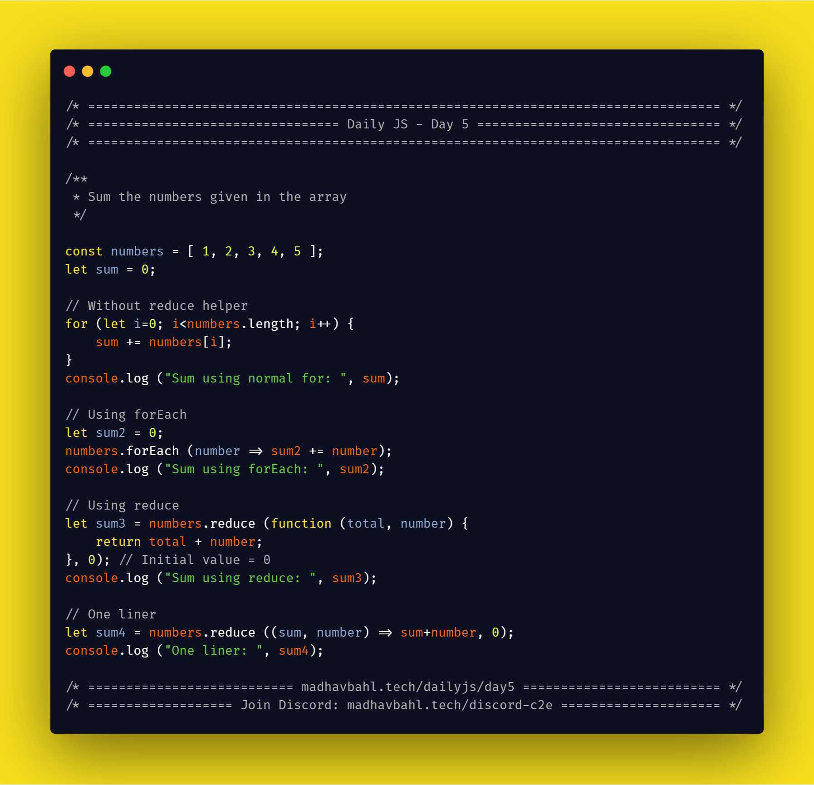

# Day 7: The `Reduce` helper


Probably the toughest in the helpers, that's why I kept it for the last. You might hear people saying it's tough, but it's not, it's all about understanding, once you get it, you will see it's the most flexible helper from which you can implement a lot of things.

**How it works?**

Let's discuss a very simple use case, to calculate the sum of the numbers given in the array

Just like other helpers, we will call the `reduce` helper on the array. Inside the reduce, we have 2 arguments, 

- The iterator function 
- initial value

The iterator function requires 2 values

- total
- current value

The idea is that `total` will start with the `initial value` (the second argument of `reduce`). Along with the `total` and `current value`, we will perform some operations (as we need) inside the iterator function and the final value which we return from the iterator function will be used as the value of `total` in the next iteration.

Ok, I know that might sound a little confusing, but reading the syntax, and the flow diagram and going through the example should make it clear.

## Syntax

```js
array.reduce(function(total, currentValue, currentIndex, arr), initialValue)
```

- **total**: Required.
    The initialValue, or the previously returned value of the function
- **currentValue**: Required.
    The value of the current element
- **currentIndex**: Optional.
    The array index of the current element
- **arr**: Optional.
    The array object the current element belongs to
- **initialValue**: Optional.
    A value to be passed to the function as the initial value

## Flow Diagram



## [Simplest, most common example](./1.js)

**Sum the numbers given in the array**

```js
const numbers = [ 1, 2, 3, 4, 5 ];
let sum = 0;

// Without reduce helper
for (let i=0; i<numbers.length; i++) {
    sum += numbers[i];
}
console.log ("Sum using normal for: ", sum);

// Using forEach
let sum2 = 0;
numbers.forEach (number => sum2 += number);
console.log ("Sum using forEach: ", sum2);

// Using reduce
let sum3 = numbers.reduce (function (total, number) {
    return total + number;
}, 0); // Initial value = 0
console.log ("Sum using reduce: ", sum3);

// One liner
let sum4 = numbers.reduce ((sum, number) => sum+number, 0);
console.log ("One liner: ", sum4);
```

## [Second Example](./2.js)

**Extract the names of students in an array from student information list**

```js
const students = [
    { name: 'Amanda', age: 32 },
    { name: 'Kepler', age: 20 },
    { name: 'Stan', age: 25 },
    { name: 'John', age: 16 },
    { name: 'Matt', age: 20 },
    { name: 'Dan', age: 17 }
];

const studentNames = students.reduce ((names, student) => {
    names.push (student.name);
    return names;
}, []);

console.log ("Student names: ", studentNames);
```

## Homework for you

1. Multiply all elements in the given array.

2. Using reduce helper, remove the repetative elements from the given array.

3. A website is scraped and all the `<p>` tags are extracted in an array, preprocess the data to remove the tags and extract information. Store the extracted information in a separate array.

4. From a given string, make a new string which is reverse of the original one (using `reduce` helper)

## Download your free eBook

<a href="./ebook.pdf" style="display: inline-block; margin: 0.3em; padding: 1.2em 5em; overflow: hidden; position: relative; text-decoration: none; text-transform: uppercase; border-radius: 3px;  -webkit-transition: 0.3s; -moz-transition: 0.3s; -ms-transition: 0.3s; -o-transition: 0.3s;  transition: 0.3s; box-shadow: 0 2px 10px rgba(0,0,0,0.5); border: none;  font-size: 15px; text-align: center;   background-color: #03A9F4; color: white; margin-left: 38%;" download class="btn-rounded-white">Claim Your Free PDF Here</a>

## Carbon code sample

